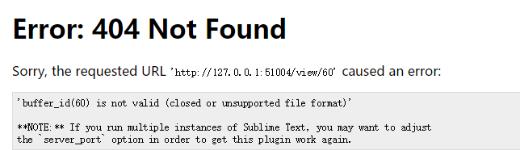

# Markdown

[TOC]

## Sublime Plugins

#### 1. MarkDown Editing

#### 2. OmniMarkupPrevie  
    此插件可以实现在浏览器中实时预览。

###### 可以遇到的错误

> ##### 解决方案
> 在Sublime Text > Preferences > Package Settings > OmniMarkupPreviewer > Settings - User  中追加以下内容:  
>    {
>        "renderer_options-MarkdownRenderer": {
>           "extensions": ["tables", "fenced_code", "codehilite"]
>        }
>    }

###### 常用快捷键
1. Ctrl + Alt + O : 打开浏览器，并预览Markdown文本。
2. Ctrl + Alt + X : 自动导出HTML文件到Markdown文本所在的目录下。
3. Ctrl + Alt + C : 复制HTML